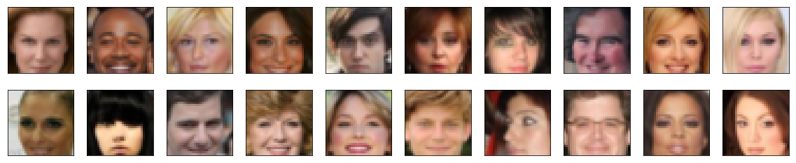
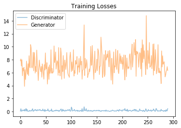
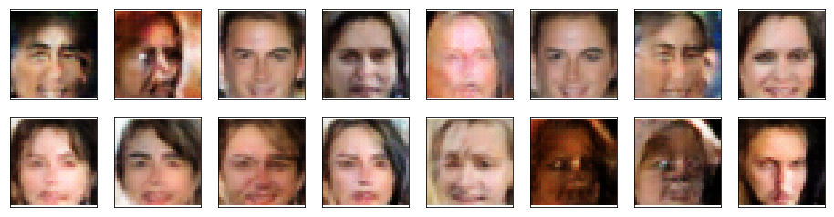

# Face Generation

In this project, you'll define and train a DCGAN on a dataset of faces. Your goal is to get a generator network to generate *new* images of faces that look as realistic as possible!

The project will be broken down into a series of tasks from **loading in data to defining and training adversarial networks**. At the end of the notebook, you'll be able to visualize the results of your trained Generator to see how it performs; your generated samples should look like fairly realistic faces with small amounts of noise.

### Get the Data

You'll be using the [CelebFaces Attributes Dataset (CelebA)](http://mmlab.ie.cuhk.edu.hk/projects/CelebA.html) to train your adversarial networks.

This dataset is more complex than the number datasets (like MNIST or SVHN) you've been working with, and so, you should prepare to define deeper networks and train them for a longer time to get good results. It is suggested that you utilize a GPU for training.

### Pre-processed Data

Since the project's main focus is on building the GANs, we've done *some* of the pre-processing for you. Each of the CelebA images has been cropped to remove parts of the image that don't include a face, then resized down to 64x64x3 NumPy images. Some sample data is show below.


> If you are working locally, you can download this data [by clicking here](https://s3.amazonaws.com/video.udacity-data.com/topher/2018/November/5be7eb6f_processed-celeba-small/processed-celeba-small.zip)

This is a zip file that you'll need to extract in the home directory of this notebook for further loading and processing. After extracting the data, you should be left with a directory of data `processed_celeba_small/`


```python
# can comment out after executing
#!unzip processed_celeba_small.zip
```


```python
data_dir = 'processed_celeba_small/'

"""
DON'T MODIFY ANYTHING IN THIS CELL
"""
import pickle as pkl
import matplotlib.pyplot as plt
import numpy as np
import problem_unittests as tests
#import helper

%matplotlib inline
```

## Visualize the CelebA Data

The [CelebA](http://mmlab.ie.cuhk.edu.hk/projects/CelebA.html) dataset contains over 200,000 celebrity images with annotations. Since you're going to be generating faces, you won't need the annotations, you'll only need the images. Note that these are color images with [3 color channels (RGB)](https://en.wikipedia.org/wiki/Channel_(digital_image)#RGB_Images) each.

### Pre-process and Load the Data

Since the project's main focus is on building the GANs, we've done *some* of the pre-processing for you. Each of the CelebA images has been cropped to remove parts of the image that don't include a face, then resized down to 64x64x3 NumPy images. This *pre-processed* dataset is a smaller subset of the very large CelebA data.

> There are a few other steps that you'll need to **transform** this data and create a **DataLoader**.

#### Exercise: Complete the following `get_dataloader` function, such that it satisfies these requirements:

* Your images should be square, Tensor images of size `image_size x image_size` in the x and y dimension.
* Your function should return a DataLoader that shuffles and batches these Tensor images.

#### ImageFolder

To create a dataset given a directory of images, it's recommended that you use PyTorch's [ImageFolder](https://pytorch.org/docs/stable/torchvision/datasets.html#imagefolder) wrapper, with a root directory `processed_celeba_small/` and data transformation passed in.


```python
# necessary imports
import torch
from torchvision import datasets
from torchvision import transforms
```


```python
def get_dataloader(batch_size, image_size, data_dir='processed_celeba_small/'):
    """
    Batch the neural network data using DataLoader
    :param batch_size: The size of each batch; the number of images in a batch
    :param img_size: The square size of the image data (x, y)
    :param data_dir: Directory where image data is located
    :return: DataLoader with batched data
    """
    
    # TODO: Implement function and return a dataloader
    transform = transforms.Compose([transforms.Resize(image_size),transforms.ToTensor()])
    data = datasets.ImageFolder(data_dir,transform = transform)
    
    dataLoader = torch.utils.data.DataLoader(data,batch_size = batch_size, shuffle= True)
    
    return dataLoader

```

## Create a DataLoader

#### Exercise: Create a DataLoader `celeba_train_loader` with appropriate hyperparameters.

Call the above function and create a dataloader to view images. 
* You can decide on any reasonable `batch_size` parameter
* Your `image_size` **must be** `32`. Resizing the data to a smaller size will make for faster training, while still creating convincing images of faces!


```python
# Define function hyperparameters
batch_size = 64
img_size = 32

"""
DON'T MODIFY ANYTHING IN THIS CELL THAT IS BELOW THIS LINE
"""
# Call your function and get a dataloader
celeba_train_loader = get_dataloader(batch_size, img_size)

```

Next, you can view some images! You should seen square images of somewhat-centered faces.

Note: You'll need to convert the Tensor images into a NumPy type and transpose the dimensions to correctly display an image, suggested `imshow` code is below, but it may not be perfect.


```python
# helper display function
def imshow(img):
    npimg = img.numpy()
    plt.imshow(np.transpose(npimg, (1, 2, 0)))

"""
DON'T MODIFY ANYTHING IN THIS CELL THAT IS BELOW THIS LINE
"""
# obtain one batch of training images
dataiter = iter(celeba_train_loader)
images, _ = dataiter.next() # _ for no labels

# plot the images in the batch, along with the corresponding labels
fig = plt.figure(figsize=(20, 4))
plot_size=20
for idx in np.arange(plot_size):
    ax = fig.add_subplot(2, plot_size/2, idx+1, xticks=[], yticks=[])
    imshow(images[idx])
```





#### Exercise: Pre-process your image data and scale it to a pixel range of -1 to 1

You need to do a bit of pre-processing; you know that the output of a `tanh` activated generator will contain pixel values in a range from -1 to 1, and so, we need to rescale our training images to a range of -1 to 1. (Right now, they are in a range from 0-1.)


```python
# TODO: Complete the scale function
def scale(x, feature_range=(-1, 1)):
    ''' Scale takes in an image x and returns that image, scaled
       with a feature_range of pixel values from -1 to 1. 
       This function assumes that the input x is already scaled from 0-1.'''
    # assume x is scaled to (0, 1)
    # scale to feature_range and return scaled x
    x = x*2 - 1
    return x

```


```python
"""
DON'T MODIFY ANYTHING IN THIS CELL THAT IS BELOW THIS LINE
"""
# check scaled range
# should be close to -1 to 1
img = images[0]
scaled_img = scale(img)

print('Min: ', scaled_img.min())
print('Max: ', scaled_img.max())
```

    Min:  tensor(-1.)
    Max:  tensor(0.7961)


---
# Define the Model

A GAN is comprised of two adversarial networks, a discriminator and a generator.

## Discriminator

Your first task will be to define the discriminator. This is a convolutional classifier like you've built before, only without any maxpooling layers. To deal with this complex data, it's suggested you use a deep network with **normalization**. You are also allowed to create any helper functions that may be useful.

#### Exercise: Complete the Discriminator class
* The inputs to the discriminator are 32x32x3 tensor images
* The output should be a single value that will indicate whether a given image is real or fake


```python
import torch.nn as nn
import torch.nn.functional as F
```


```python
#Created helper funtion for convolutional layers

def conv(in_channels,out_channels,kernel_size=4,stride = 2,padding=1,batch_norm = True):
  
    layer = list()
    layer.append(nn.Conv2d(in_channels,out_channels,kernel_size,stride,padding))
  
    if(batch_norm):
        layer.append(nn.BatchNorm2d(out_channels))
  
    return nn.Sequential(*layer)
```


```python

class Discriminator(nn.Module):

    def __init__(self, conv_dim):
        """
        Initialize the Discriminator Module
        :param conv_dim: The depth of the first convolutional layer
        """
        self.conv_dim  = conv_dim
        
        super(Discriminator, self).__init__()

        self.conv1 = conv(3,conv_dim,4,2)     #16x16x32
        self.conv2 = conv(conv_dim,conv_dim*2,4,2)    #8x8x64
        self.conv3 = conv(conv_dim*2,conv_dim*4,4,2)   #4x4x128
        self.conv4 = conv(conv_dim*4,conv_dim*8,4,2,batch_norm=False)  #2x2x256 
        
        self.fc1 = nn.Linear(2*2*conv_dim*8,512)
        self.fc2 = nn.Linear(512,1)
        
        self.drp = nn.Dropout(0.3)
         
        # complete init function
        

    def forward(self, x):
        
        """
        Forward propagation of the neural network
        :param x: The input to the neural network     
        :return: Discriminator logits; the output of the neural network
        """
        # define feedforward behavior
        x = F.leaky_relu(self.conv1(x))
        x = F.leaky_relu(self.conv2(x))
        x = F.leaky_relu(self.conv3(x))
        x = F.leaky_relu(self.conv4(x))
        
        x = x.reshape(-1,2*2*self.conv_dim*8)
        x = F.leaky_relu(self.fc1(x))
        x = self.drp(x)
        x = self.fc2(x)
        
        return x


"""
DON'T MODIFY ANYTHING IN THIS CELL THAT IS BELOW THIS LINE
"""
tests.test_discriminator(Discriminator)
```

    Tests Passed


## Generator

The generator should upsample an input and generate a *new* image of the same size as our training data `32x32x3`. This should be mostly transpose convolutional layers with normalization applied to the outputs.

#### Exercise: Complete the Generator class
* The inputs to the generator are vectors of some length `z_size`
* The output should be a image of shape `32x32x3`


```python
#Created helper funtion for convolutional layers

def deconv(in_channels,out_channels,kernel_size=4,stride = 2,padding=1,batch_norm = True):
  
    layer = list()
    layer.append(nn.ConvTranspose2d(in_channels,out_channels,kernel_size,stride,padding))

    if(batch_norm):
        layer.append(nn.BatchNorm2d(out_channels))

    return nn.Sequential(*layer)
```


```python
class Generator(nn.Module):
    
    def __init__(self, z_size, conv_dim):
        """
        Initialize the Generator Module
        :param z_size: The length of the input latent vector, z
        :param conv_dim: The depth of the inputs to the *last* transpose convolutional layer
        """
        super(Generator, self).__init__()

        # complete init function
        self.conv_dim = conv_dim = 1024
        self.fc1 = nn.Linear(z_size,1*1*conv_dim)
        
        self.conv1 = deconv(conv_dim,conv_dim//2,4,2)     #2*2*conv_dim/2
        self.conv2 = deconv(conv_dim//2,conv_dim//4)            #4*4*conv_dim/4
        self.conv3 = deconv(conv_dim//4,conv_dim//8)            #8*8*conv_dim/8
        self.conv4 = deconv(conv_dim//8,conv_dim//16)            #16*16*3
        self.conv5 = deconv(conv_dim//16,3,batch_norm = False)   #32*32*3

    def forward(self, x):
        """
        Forward propagation of the neural network
        :param x: The input to the neural network     
        :return: A 32x32x3 Tensor image as output
        """
        # define feedforward behavior
        
        x = F.leaky_relu(self.fc1(x))
        x = x.reshape(-1,self.conv_dim,1,1)
        
        x = F.leaky_relu(self.conv1(x))
        
        x = F.leaky_relu(self.conv2(x))
        
        x = F.leaky_relu(self.conv3(x))
        
        x = F.leaky_relu(self.conv4(x))
        
        x = torch.tanh(self.conv5(x))
        
        
        return x

"""
DON'T MODIFY ANYTHING IN THIS CELL THAT IS BELOW THIS LINE
"""
tests.test_generator(Generator)
```

    Tests Passed


## Initialize the weights of your networks

To help your models converge, you should initialize the weights of the convolutional and linear layers in your model. From reading the [original DCGAN paper](https://arxiv.org/pdf/1511.06434.pdf), they say:
> All weights were initialized from a zero-centered Normal distribution with standard deviation 0.02.

So, your next task will be to define a weight initialization function that does just this!

You can refer back to the lesson on weight initialization or even consult existing model code, such as that from [the `networks.py` file in CycleGAN Github repository](https://github.com/junyanz/pytorch-CycleGAN-and-pix2pix/blob/master/models/networks.py) to help you complete this function.

#### Exercise: Complete the weight initialization function

* This should initialize only **convolutional** and **linear** layers
* Initialize the weights to a normal distribution, centered around 0, with a standard deviation of 0.02.
* The bias terms, if they exist, may be left alone or set to 0.


```python
def weights_init_normal(m):
    """
    Applies initial weights to certain layers in a model .
    The weights are taken from a normal distribution 
    with mean = 0, std dev = 0.02.
    :param m: A module or layer in a network    
    """
    # classname will be something like:
    # `Conv`, `BatchNorm2d`, `Linear`, etc.
    classname = m.__class__.__name__
    
    # TODO: Apply initial weights to convolutional and linear layers
    
    if classname.find('Linear') != -1 or classname.find('Conv') != -1:
        m.weight.data.normal_(0.0, 0.02)
        m.bias.data.fill_(0)
     
```

## Build complete network

Define your models' hyperparameters and instantiate the discriminator and generator from the classes defined above. Make sure you've passed in the correct input arguments.


```python
"""
DON'T MODIFY ANYTHING IN THIS CELL THAT IS BELOW THIS LINE
"""
def build_network(d_conv_dim, g_conv_dim, z_size):
    # define discriminator and generator
    D = Discriminator(d_conv_dim)
    G = Generator(z_size=z_size, conv_dim=g_conv_dim)

    # initialize model weights
    D.apply(weights_init_normal)
    G.apply(weights_init_normal)

    print(D)
    print()
    print(G)
    
    return D, G

```

#### Exercise: Define model hyperparameters


```python
# Define model hyperparams
d_conv_dim = 64
g_conv_dim = 1024
z_size = 100 

"""
DON'T MODIFY ANYTHING IN THIS CELL THAT IS BELOW THIS LINE
"""
D, G = build_network(d_conv_dim, g_conv_dim, z_size)
```

    Discriminator(
      (conv1): Sequential(
        (0): Conv2d(3, 64, kernel_size=(4, 4), stride=(2, 2), padding=(1, 1))
        (1): BatchNorm2d(64, eps=1e-05, momentum=0.1, affine=True, track_running_stats=True)
      )
      (conv2): Sequential(
        (0): Conv2d(64, 128, kernel_size=(4, 4), stride=(2, 2), padding=(1, 1))
        (1): BatchNorm2d(128, eps=1e-05, momentum=0.1, affine=True, track_running_stats=True)
      )
      (conv3): Sequential(
        (0): Conv2d(128, 256, kernel_size=(4, 4), stride=(2, 2), padding=(1, 1))
        (1): BatchNorm2d(256, eps=1e-05, momentum=0.1, affine=True, track_running_stats=True)
      )
      (conv4): Sequential(
        (0): Conv2d(256, 512, kernel_size=(4, 4), stride=(2, 2), padding=(1, 1))
      )
      (fc1): Linear(in_features=2048, out_features=512, bias=True)
      (fc2): Linear(in_features=512, out_features=1, bias=True)
      (drp): Dropout(p=0.3)
    )
    
    Generator(
      (fc1): Linear(in_features=100, out_features=1024, bias=True)
      (conv1): Sequential(
        (0): ConvTranspose2d(1024, 512, kernel_size=(4, 4), stride=(2, 2), padding=(1, 1))
        (1): BatchNorm2d(512, eps=1e-05, momentum=0.1, affine=True, track_running_stats=True)
      )
      (conv2): Sequential(
        (0): ConvTranspose2d(512, 256, kernel_size=(4, 4), stride=(2, 2), padding=(1, 1))
        (1): BatchNorm2d(256, eps=1e-05, momentum=0.1, affine=True, track_running_stats=True)
      )
      (conv3): Sequential(
        (0): ConvTranspose2d(256, 128, kernel_size=(4, 4), stride=(2, 2), padding=(1, 1))
        (1): BatchNorm2d(128, eps=1e-05, momentum=0.1, affine=True, track_running_stats=True)
      )
      (conv4): Sequential(
        (0): ConvTranspose2d(128, 64, kernel_size=(4, 4), stride=(2, 2), padding=(1, 1))
        (1): BatchNorm2d(64, eps=1e-05, momentum=0.1, affine=True, track_running_stats=True)
      )
      (conv5): Sequential(
        (0): ConvTranspose2d(64, 3, kernel_size=(4, 4), stride=(2, 2), padding=(1, 1))
      )
    )


### Training on GPU

Check if you can train on GPU. Here, we'll set this as a boolean variable `train_on_gpu`. Later, you'll be responsible for making sure that 
>* Models,
* Model inputs, and
* Loss function arguments

Are moved to GPU, where appropriate.


```python
"""
DON'T MODIFY ANYTHING IN THIS CELL
"""
import torch

# Check for a GPU
train_on_gpu = torch.cuda.is_available()
if not train_on_gpu:
    print('No GPU found. Please use a GPU to train your neural network.')
else:
    print('Training on GPU!')
```

    Training on GPU!


---
## Discriminator and Generator Losses

Now we need to calculate the losses for both types of adversarial networks.

### Discriminator Losses

> * For the discriminator, the total loss is the sum of the losses for real and fake images, `d_loss = d_real_loss + d_fake_loss`. 
* Remember that we want the discriminator to output 1 for real images and 0 for fake images, so we need to set up the losses to reflect that.


### Generator Loss

The generator loss will look similar only with flipped labels. The generator's goal is to get the discriminator to *think* its generated images are *real*.

#### Exercise: Complete real and fake loss functions

**You may choose to use either cross entropy or a least squares error loss to complete the following `real_loss` and `fake_loss` functions.**


```python
def real_loss(D_out):
    '''Calculates how close discriminator outputs are to being real.
       param, D_out: discriminator logits
       return: real loss'''
    criterian = nn.BCEWithLogitsLoss()
    target = torch.ones(*D_out.shape)
    
    if train_on_gpu:
        target = target.cuda()
    loss = criterian(D_out,target)
    return loss

def fake_loss(D_out):
    '''Calculates how close discriminator outputs are to being fake.
       param, D_out: discriminator logits
       return: fake loss'''
    criterian = nn.BCEWithLogitsLoss()
    target = torch.zeros(*D_out.shape)
    
    if train_on_gpu:
        target = target.cuda()
    loss = criterian(D_out,target)
    return loss
```

## Optimizers

#### Exercise: Define optimizers for your Discriminator (D) and Generator (G)

Define optimizers for your models with appropriate hyperparameters.


```python
import torch.optim as optim

# Create optimizers for the discriminator D and generator G
d_optimizer = optim.Adam(D.parameters(),lr = 0.0002)
g_optimizer = optim.Adam(G.parameters(),lr = 0.0002)
```

---
## Training

Training will involve alternating between training the discriminator and the generator. You'll use your functions `real_loss` and `fake_loss` to help you calculate the discriminator losses.

* You should train the discriminator by alternating on real and fake images
* Then the generator, which tries to trick the discriminator and should have an opposing loss function


#### Saving Samples

You've been given some code to print out some loss statistics and save some generated "fake" samples.

#### Exercise: Complete the training function

Keep in mind that, if you've moved your models to GPU, you'll also have to move any model inputs to GPU.


```python
def train(D, G, n_epochs, print_every=50):
    '''Trains adversarial networks for some number of epochs
       param, D: the discriminator network
       param, G: the generator network
       param, n_epochs: number of epochs to train for
       param, print_every: when to print and record the models' losses
       return: D and G losses'''
    
    # move models to GPU
    if train_on_gpu:
        D.cuda()
        G.cuda()

    # keep track of loss and generated, "fake" samples
    samples = []
    losses = []

    # Get some fixed data for sampling. These are images that are held
    # constant throughout training, and allow us to inspect the model's performance
    sample_size=16
    fixed_z = np.random.uniform(-1, 1, size=(sample_size, z_size))
    fixed_z = torch.from_numpy(fixed_z).float()
    # move z to GPU if available
    if train_on_gpu:
        fixed_z = fixed_z.cuda()

    # epoch training loop
    for epoch in range(n_epochs):

        # batch training loop
        for batch_i, (real_images, _) in enumerate(celeba_train_loader):

            batch_size = real_images.size(0)
            real_images = scale(real_images)

            # ===============================================
            #         YOUR CODE HERE: TRAIN THE NETWORKS
            # ===============================================
            
            # 1. Train the discriminator on real and fake images
            d_optimizer.zero_grad()
            
            if train_on_gpu:
                real_images = real_images.cuda()
                
            #print(real_images.device)
            d_out = D(real_images)
            d_real_loss = real_loss(d_out)
            
            z = np.random.uniform(-1, 1, size=(sample_size, z_size))
            z = torch.from_numpy(z).float()
            
            if train_on_gpu:
                z = z.cuda()
            fake_out = G(z)
            
            g_fake_loss = fake_loss(D(fake_out))
            
            d_loss = d_real_loss + g_fake_loss 
            d_loss.backward()
            d_optimizer.step()

            # 2. Train the generator with an adversarial loss
            g_optimizer.zero_grad()
            
            g_out = G(z)
            d_real_out = D(g_out)
            g_loss = real_loss(d_real_out)
            
            g_loss.backward()
            g_optimizer.step()
            
            # ===============================================
            #              END OF YOUR CODE
            # ===============================================

            # Print some loss stats
            if batch_i % print_every == 0:
                # append discriminator loss and generator loss
                losses.append((d_loss.item(), g_loss.item()))
                # print discriminator and generator loss
                print('Epoch [{:5d}/{:5d}] | d_loss: {:6.4f} | g_loss: {:6.4f}'.format(
                        epoch+1, n_epochs, d_loss.item(), g_loss.item()))


        ## AFTER EACH EPOCH##    
        # this code assumes your generator is named G, feel free to change the name
        # generate and save sample, fake images
        G.eval() # for generating samples
        samples_z = G(fixed_z)
        samples.append(samples_z)
        G.train() # back to training mode

    # Save training generator samples
    with open('train_samples.pkl', 'wb') as f:
        pkl.dump(samples, f)
    
    # finally return losses
    return losses
```

Set your number of training epochs and train your GAN!


```python
# set number of epochs 
n_epochs = 10


"""
DON'T MODIFY ANYTHING IN THIS CELL
"""
# call training function
losses = train(D, G, n_epochs=n_epochs)
```

    Epoch [    1/   10] | d_loss: 0.0706 | g_loss: 7.8358
    Epoch [    1/   10] | d_loss: 0.4304 | g_loss: 8.1006
    Epoch [    1/   10] | d_loss: 0.0567 | g_loss: 7.0322
    Epoch [    1/   10] | d_loss: 0.0560 | g_loss: 7.9887
    Epoch [    1/   10] | d_loss: 0.2224 | g_loss: 5.5149
    Epoch [    1/   10] | d_loss: 0.1649 | g_loss: 6.6854
    Epoch [    1/   10] | d_loss: 0.2090 | g_loss: 6.2719
    Epoch [    1/   10] | d_loss: 0.1055 | g_loss: 6.8277
    Epoch [    1/   10] | d_loss: 0.3272 | g_loss: 3.8876
    Epoch [    1/   10] | d_loss: 0.0723 | g_loss: 6.4595
    Epoch [    1/   10] | d_loss: 0.2101 | g_loss: 4.9384
    Epoch [    1/   10] | d_loss: 0.4655 | g_loss: 5.9646
    Epoch [    1/   10] | d_loss: 0.0702 | g_loss: 7.7801
    Epoch [    1/   10] | d_loss: 0.3292 | g_loss: 6.2686
    Epoch [    1/   10] | d_loss: 0.0669 | g_loss: 5.7485
    Epoch [    1/   10] | d_loss: 0.0213 | g_loss: 7.3731
    Epoch [    1/   10] | d_loss: 0.0678 | g_loss: 5.5519
    Epoch [    1/   10] | d_loss: 0.0584 | g_loss: 8.6111
    Epoch [    1/   10] | d_loss: 0.1809 | g_loss: 6.9620
    Epoch [    1/   10] | d_loss: 0.0648 | g_loss: 6.7368
    Epoch [    1/   10] | d_loss: 0.1023 | g_loss: 10.3258
    Epoch [    1/   10] | d_loss: 0.1441 | g_loss: 9.8176
    Epoch [    1/   10] | d_loss: 0.0817 | g_loss: 6.8707
    Epoch [    1/   10] | d_loss: 0.2884 | g_loss: 6.7238
    Epoch [    1/   10] | d_loss: 0.4205 | g_loss: 7.0828
    Epoch [    1/   10] | d_loss: 0.0316 | g_loss: 9.1429
    Epoch [    1/   10] | d_loss: 0.1320 | g_loss: 6.2776
    Epoch [    1/   10] | d_loss: 0.1083 | g_loss: 9.1096
    Epoch [    1/   10] | d_loss: 0.2530 | g_loss: 8.2839
    Epoch [    2/   10] | d_loss: 0.3133 | g_loss: 5.9284
    Epoch [    2/   10] | d_loss: 0.1599 | g_loss: 6.9535
    Epoch [    2/   10] | d_loss: 0.2529 | g_loss: 6.1453
    Epoch [    2/   10] | d_loss: 0.1103 | g_loss: 9.4812
    Epoch [    2/   10] | d_loss: 0.1265 | g_loss: 7.5635
    Epoch [    2/   10] | d_loss: 0.2942 | g_loss: 6.5440
    Epoch [    2/   10] | d_loss: 0.2390 | g_loss: 4.7812
    Epoch [    2/   10] | d_loss: 0.1782 | g_loss: 6.2449
    Epoch [    2/   10] | d_loss: 0.1843 | g_loss: 7.9300
    Epoch [    2/   10] | d_loss: 0.3290 | g_loss: 7.0822
    Epoch [    2/   10] | d_loss: 0.2416 | g_loss: 6.4953
    Epoch [    2/   10] | d_loss: 0.1234 | g_loss: 6.1388
    Epoch [    2/   10] | d_loss: 0.1695 | g_loss: 6.9588
    Epoch [    2/   10] | d_loss: 0.1234 | g_loss: 5.3013
    Epoch [    2/   10] | d_loss: 0.1308 | g_loss: 7.3452
    Epoch [    2/   10] | d_loss: 0.3800 | g_loss: 6.7505
    Epoch [    2/   10] | d_loss: 0.1479 | g_loss: 5.8414
    Epoch [    2/   10] | d_loss: 0.1631 | g_loss: 5.0012
    Epoch [    2/   10] | d_loss: 0.0261 | g_loss: 7.2297
    Epoch [    2/   10] | d_loss: 0.3336 | g_loss: 6.3897
    Epoch [    2/   10] | d_loss: 0.0570 | g_loss: 9.0458
    Epoch [    2/   10] | d_loss: 0.1344 | g_loss: 6.6781
    Epoch [    2/   10] | d_loss: 0.1721 | g_loss: 6.5752
    Epoch [    2/   10] | d_loss: 0.1584 | g_loss: 7.5389
    Epoch [    2/   10] | d_loss: 0.1505 | g_loss: 4.2387
    Epoch [    2/   10] | d_loss: 0.3985 | g_loss: 5.9759
    Epoch [    2/   10] | d_loss: 0.0981 | g_loss: 6.8870
    Epoch [    2/   10] | d_loss: 0.1174 | g_loss: 4.9610
    Epoch [    2/   10] | d_loss: 0.0288 | g_loss: 7.1943
    Epoch [    3/   10] | d_loss: 0.1082 | g_loss: 5.8962
    Epoch [    3/   10] | d_loss: 0.1429 | g_loss: 6.2869
    Epoch [    3/   10] | d_loss: 0.1125 | g_loss: 9.5297
    Epoch [    3/   10] | d_loss: 0.3935 | g_loss: 5.9199
    Epoch [    3/   10] | d_loss: 0.0202 | g_loss: 6.6756
    Epoch [    3/   10] | d_loss: 0.0961 | g_loss: 5.9108
    Epoch [    3/   10] | d_loss: 0.0329 | g_loss: 6.0652
    Epoch [    3/   10] | d_loss: 0.0439 | g_loss: 6.1481
    Epoch [    3/   10] | d_loss: 0.1227 | g_loss: 10.1207
    Epoch [    3/   10] | d_loss: 0.1528 | g_loss: 7.5616
    Epoch [    3/   10] | d_loss: 0.0776 | g_loss: 7.9832
    Epoch [    3/   10] | d_loss: 0.2150 | g_loss: 9.1923
    Epoch [    3/   10] | d_loss: 0.1344 | g_loss: 6.5529
    Epoch [    3/   10] | d_loss: 0.2222 | g_loss: 7.1755
    Epoch [    3/   10] | d_loss: 0.0951 | g_loss: 7.8243
    Epoch [    3/   10] | d_loss: 0.1624 | g_loss: 7.6036
    Epoch [    3/   10] | d_loss: 0.1859 | g_loss: 5.5863
    Epoch [    3/   10] | d_loss: 0.0294 | g_loss: 9.8787
    Epoch [    3/   10] | d_loss: 0.1372 | g_loss: 6.0001
    Epoch [    3/   10] | d_loss: 0.0562 | g_loss: 6.3551
    Epoch [    3/   10] | d_loss: 0.2105 | g_loss: 5.4987
    Epoch [    3/   10] | d_loss: 0.3346 | g_loss: 9.8012
    Epoch [    3/   10] | d_loss: 0.3861 | g_loss: 9.0260
    Epoch [    3/   10] | d_loss: 0.0338 | g_loss: 4.9779
    Epoch [    3/   10] | d_loss: 0.0675 | g_loss: 7.0834
    Epoch [    3/   10] | d_loss: 0.3466 | g_loss: 6.1810
    Epoch [    3/   10] | d_loss: 0.0879 | g_loss: 8.6399
    Epoch [    3/   10] | d_loss: 0.2170 | g_loss: 7.1220
    Epoch [    3/   10] | d_loss: 0.1733 | g_loss: 5.1108
    Epoch [    4/   10] | d_loss: 0.0429 | g_loss: 7.9420
    Epoch [    4/   10] | d_loss: 0.0908 | g_loss: 7.4853
    Epoch [    4/   10] | d_loss: 0.2286 | g_loss: 6.4904
    Epoch [    4/   10] | d_loss: 0.1167 | g_loss: 7.2970
    Epoch [    4/   10] | d_loss: 0.1141 | g_loss: 9.1039
    Epoch [    4/   10] | d_loss: 0.2067 | g_loss: 7.0629
    Epoch [    4/   10] | d_loss: 0.2782 | g_loss: 5.9660
    Epoch [    4/   10] | d_loss: 0.1633 | g_loss: 5.6026
    Epoch [    4/   10] | d_loss: 0.1803 | g_loss: 5.5241
    Epoch [    4/   10] | d_loss: 0.3372 | g_loss: 5.2883
    Epoch [    4/   10] | d_loss: 0.1030 | g_loss: 8.4309
    Epoch [    4/   10] | d_loss: 0.0589 | g_loss: 9.1616
    Epoch [    4/   10] | d_loss: 0.0814 | g_loss: 7.9885
    Epoch [    4/   10] | d_loss: 0.6787 | g_loss: 6.1621
    Epoch [    4/   10] | d_loss: 0.4994 | g_loss: 7.6540
    Epoch [    4/   10] | d_loss: 0.0829 | g_loss: 6.3087
    Epoch [    4/   10] | d_loss: 0.1128 | g_loss: 6.9221
    Epoch [    4/   10] | d_loss: 0.1476 | g_loss: 9.5350
    Epoch [    4/   10] | d_loss: 0.2012 | g_loss: 5.4746
    Epoch [    4/   10] | d_loss: 0.3194 | g_loss: 6.3158
    Epoch [    4/   10] | d_loss: 0.0962 | g_loss: 5.8901
    Epoch [    4/   10] | d_loss: 0.0933 | g_loss: 7.8746
    Epoch [    4/   10] | d_loss: 0.0940 | g_loss: 7.3156
    Epoch [    4/   10] | d_loss: 0.1708 | g_loss: 7.3961
    Epoch [    4/   10] | d_loss: 0.1930 | g_loss: 8.4772
    Epoch [    4/   10] | d_loss: 0.0370 | g_loss: 5.7256
    Epoch [    4/   10] | d_loss: 0.1865 | g_loss: 7.0181
    Epoch [    4/   10] | d_loss: 0.0750 | g_loss: 6.8442
    Epoch [    4/   10] | d_loss: 0.0717 | g_loss: 8.1867
    Epoch [    5/   10] | d_loss: 0.0291 | g_loss: 6.0590
    Epoch [    5/   10] | d_loss: 0.1735 | g_loss: 6.9390
    Epoch [    5/   10] | d_loss: 0.1642 | g_loss: 8.5202
    Epoch [    5/   10] | d_loss: 0.0799 | g_loss: 7.1894
    Epoch [    5/   10] | d_loss: 0.0233 | g_loss: 7.7324
    Epoch [    5/   10] | d_loss: 0.4505 | g_loss: 4.9908
    Epoch [    5/   10] | d_loss: 0.0365 | g_loss: 6.3689
    Epoch [    5/   10] | d_loss: 0.0535 | g_loss: 6.4272
    Epoch [    5/   10] | d_loss: 0.1372 | g_loss: 9.6242
    Epoch [    5/   10] | d_loss: 0.7263 | g_loss: 13.3672
    Epoch [    5/   10] | d_loss: 0.1647 | g_loss: 5.5447
    Epoch [    5/   10] | d_loss: 0.1065 | g_loss: 8.2087
    Epoch [    5/   10] | d_loss: 0.1918 | g_loss: 6.6801
    Epoch [    5/   10] | d_loss: 0.4463 | g_loss: 6.9530
    Epoch [    5/   10] | d_loss: 0.0851 | g_loss: 8.0133
    Epoch [    5/   10] | d_loss: 0.0979 | g_loss: 7.2145
    Epoch [    5/   10] | d_loss: 0.0540 | g_loss: 5.2483
    Epoch [    5/   10] | d_loss: 0.2176 | g_loss: 5.7695
    Epoch [    5/   10] | d_loss: 0.0677 | g_loss: 5.8356
    Epoch [    5/   10] | d_loss: 0.0939 | g_loss: 6.5735
    Epoch [    5/   10] | d_loss: 0.1349 | g_loss: 6.1501
    Epoch [    5/   10] | d_loss: 0.0758 | g_loss: 6.8759
    Epoch [    5/   10] | d_loss: 0.1747 | g_loss: 10.0525
    Epoch [    5/   10] | d_loss: 0.0564 | g_loss: 7.1263
    Epoch [    5/   10] | d_loss: 0.1197 | g_loss: 7.1930
    Epoch [    5/   10] | d_loss: 0.0667 | g_loss: 10.1922
    Epoch [    5/   10] | d_loss: 0.0143 | g_loss: 7.9315
    Epoch [    5/   10] | d_loss: 0.1514 | g_loss: 6.4264
    Epoch [    5/   10] | d_loss: 0.1118 | g_loss: 4.9660
    Epoch [    6/   10] | d_loss: 0.1923 | g_loss: 7.5936
    Epoch [    6/   10] | d_loss: 0.1284 | g_loss: 9.3275
    Epoch [    6/   10] | d_loss: 0.0909 | g_loss: 5.9864
    Epoch [    6/   10] | d_loss: 0.1348 | g_loss: 6.2339
    Epoch [    6/   10] | d_loss: 0.1904 | g_loss: 6.6570
    Epoch [    6/   10] | d_loss: 0.0898 | g_loss: 8.0830
    Epoch [    6/   10] | d_loss: 0.1477 | g_loss: 6.2944
    Epoch [    6/   10] | d_loss: 0.1765 | g_loss: 9.6711
    Epoch [    6/   10] | d_loss: 0.1907 | g_loss: 9.3912
    Epoch [    6/   10] | d_loss: 0.0714 | g_loss: 8.5790
    Epoch [    6/   10] | d_loss: 0.1909 | g_loss: 5.7055
    Epoch [    6/   10] | d_loss: 0.0819 | g_loss: 6.9603
    Epoch [    6/   10] | d_loss: 0.0793 | g_loss: 7.0156
    Epoch [    6/   10] | d_loss: 0.0057 | g_loss: 11.4802
    Epoch [    6/   10] | d_loss: 0.1419 | g_loss: 10.1315
    Epoch [    6/   10] | d_loss: 0.0839 | g_loss: 8.8461
    Epoch [    6/   10] | d_loss: 0.1411 | g_loss: 5.2454
    Epoch [    6/   10] | d_loss: 0.1213 | g_loss: 5.8159
    Epoch [    6/   10] | d_loss: 0.1350 | g_loss: 7.6221
    Epoch [    6/   10] | d_loss: 0.0642 | g_loss: 8.7731
    Epoch [    6/   10] | d_loss: 0.1554 | g_loss: 5.4075
    Epoch [    6/   10] | d_loss: 0.1372 | g_loss: 5.7283
    Epoch [    6/   10] | d_loss: 0.0412 | g_loss: 9.4076
    Epoch [    6/   10] | d_loss: 0.2319 | g_loss: 7.9397
    Epoch [    6/   10] | d_loss: 0.1049 | g_loss: 8.1793
    Epoch [    6/   10] | d_loss: 0.0502 | g_loss: 8.8355
    Epoch [    6/   10] | d_loss: 0.1091 | g_loss: 8.3514
    Epoch [    6/   10] | d_loss: 0.1186 | g_loss: 9.3324
    Epoch [    6/   10] | d_loss: 0.0726 | g_loss: 7.7716
    Epoch [    7/   10] | d_loss: 0.0461 | g_loss: 6.8952
    Epoch [    7/   10] | d_loss: 0.0244 | g_loss: 9.4249
    Epoch [    7/   10] | d_loss: 0.0235 | g_loss: 8.8579
    Epoch [    7/   10] | d_loss: 0.1083 | g_loss: 6.5398
    Epoch [    7/   10] | d_loss: 0.0935 | g_loss: 4.8408
    Epoch [    7/   10] | d_loss: 0.0761 | g_loss: 8.2178
    Epoch [    7/   10] | d_loss: 0.1867 | g_loss: 7.0747
    Epoch [    7/   10] | d_loss: 0.2154 | g_loss: 4.2242
    Epoch [    7/   10] | d_loss: 0.1183 | g_loss: 7.1270
    Epoch [    7/   10] | d_loss: 0.1083 | g_loss: 9.2026
    Epoch [    7/   10] | d_loss: 0.1019 | g_loss: 5.9726
    Epoch [    7/   10] | d_loss: 0.0533 | g_loss: 7.0493
    Epoch [    7/   10] | d_loss: 0.1183 | g_loss: 6.8901
    Epoch [    7/   10] | d_loss: 0.0902 | g_loss: 9.6082
    Epoch [    7/   10] | d_loss: 0.0549 | g_loss: 7.3264
    Epoch [    7/   10] | d_loss: 0.1068 | g_loss: 6.4981
    Epoch [    7/   10] | d_loss: 0.2444 | g_loss: 8.0874
    Epoch [    7/   10] | d_loss: 0.1365 | g_loss: 9.4334
    Epoch [    7/   10] | d_loss: 0.1699 | g_loss: 6.1608
    Epoch [    7/   10] | d_loss: 0.0393 | g_loss: 5.8618
    Epoch [    7/   10] | d_loss: 0.3157 | g_loss: 7.5570
    Epoch [    7/   10] | d_loss: 0.2118 | g_loss: 8.9262
    Epoch [    7/   10] | d_loss: 0.1768 | g_loss: 7.3823
    Epoch [    7/   10] | d_loss: 0.1938 | g_loss: 8.5914
    Epoch [    7/   10] | d_loss: 0.2079 | g_loss: 7.6811
    Epoch [    7/   10] | d_loss: 0.0667 | g_loss: 7.3376
    Epoch [    7/   10] | d_loss: 0.0826 | g_loss: 8.3818
    Epoch [    7/   10] | d_loss: 0.2685 | g_loss: 6.5085
    Epoch [    7/   10] | d_loss: 0.2375 | g_loss: 7.5370
    Epoch [    8/   10] | d_loss: 0.2423 | g_loss: 8.7361
    Epoch [    8/   10] | d_loss: 0.2089 | g_loss: 6.0262
    Epoch [    8/   10] | d_loss: 0.4594 | g_loss: 4.8790
    Epoch [    8/   10] | d_loss: 0.1315 | g_loss: 8.6968
    Epoch [    8/   10] | d_loss: 0.1389 | g_loss: 7.2661
    Epoch [    8/   10] | d_loss: 0.2474 | g_loss: 5.3716
    Epoch [    8/   10] | d_loss: 0.0711 | g_loss: 8.2657
    Epoch [    8/   10] | d_loss: 0.3488 | g_loss: 6.9865
    Epoch [    8/   10] | d_loss: 0.0331 | g_loss: 6.5703
    Epoch [    8/   10] | d_loss: 0.0635 | g_loss: 6.8902
    Epoch [    8/   10] | d_loss: 0.1773 | g_loss: 6.6757
    Epoch [    8/   10] | d_loss: 0.1280 | g_loss: 8.6974
    Epoch [    8/   10] | d_loss: 0.1958 | g_loss: 8.9026
    Epoch [    8/   10] | d_loss: 0.1772 | g_loss: 7.6230
    Epoch [    8/   10] | d_loss: 0.0630 | g_loss: 6.4546
    Epoch [    8/   10] | d_loss: 0.0462 | g_loss: 8.9170
    Epoch [    8/   10] | d_loss: 0.0992 | g_loss: 10.4052
    Epoch [    8/   10] | d_loss: 0.2079 | g_loss: 6.8545
    Epoch [    8/   10] | d_loss: 0.1044 | g_loss: 8.0318
    Epoch [    8/   10] | d_loss: 0.1416 | g_loss: 9.2021
    Epoch [    8/   10] | d_loss: 0.3260 | g_loss: 10.6467
    Epoch [    8/   10] | d_loss: 0.3209 | g_loss: 9.2487
    Epoch [    8/   10] | d_loss: 0.0547 | g_loss: 8.7236
    Epoch [    8/   10] | d_loss: 0.3053 | g_loss: 11.1075
    Epoch [    8/   10] | d_loss: 0.2842 | g_loss: 5.4347
    Epoch [    8/   10] | d_loss: 0.0594 | g_loss: 9.3081
    Epoch [    8/   10] | d_loss: 0.1293 | g_loss: 8.9171
    Epoch [    8/   10] | d_loss: 0.0359 | g_loss: 9.2197
    Epoch [    8/   10] | d_loss: 0.0901 | g_loss: 8.7692
    Epoch [    9/   10] | d_loss: 0.0260 | g_loss: 6.8435
    Epoch [    9/   10] | d_loss: 0.0887 | g_loss: 8.0390
    Epoch [    9/   10] | d_loss: 0.3964 | g_loss: 9.0772
    Epoch [    9/   10] | d_loss: 0.1964 | g_loss: 8.9891
    Epoch [    9/   10] | d_loss: 0.1261 | g_loss: 6.5746
    Epoch [    9/   10] | d_loss: 0.1204 | g_loss: 9.7736
    Epoch [    9/   10] | d_loss: 0.1602 | g_loss: 5.4045
    Epoch [    9/   10] | d_loss: 0.1259 | g_loss: 11.0649
    Epoch [    9/   10] | d_loss: 0.0176 | g_loss: 7.5676
    Epoch [    9/   10] | d_loss: 0.1658 | g_loss: 10.3188
    Epoch [    9/   10] | d_loss: 0.1985 | g_loss: 8.1416
    Epoch [    9/   10] | d_loss: 0.0132 | g_loss: 9.3888
    Epoch [    9/   10] | d_loss: 0.0136 | g_loss: 8.3322
    Epoch [    9/   10] | d_loss: 0.1283 | g_loss: 7.1106
    Epoch [    9/   10] | d_loss: 0.4206 | g_loss: 5.6858
    Epoch [    9/   10] | d_loss: 0.2646 | g_loss: 14.7980
    Epoch [    9/   10] | d_loss: 0.0307 | g_loss: 7.1496
    Epoch [    9/   10] | d_loss: 0.0804 | g_loss: 6.5458
    Epoch [    9/   10] | d_loss: 0.0587 | g_loss: 9.4133
    Epoch [    9/   10] | d_loss: 0.3052 | g_loss: 8.2825
    Epoch [    9/   10] | d_loss: 0.1495 | g_loss: 7.4242
    Epoch [    9/   10] | d_loss: 0.1551 | g_loss: 10.6505
    Epoch [    9/   10] | d_loss: 0.0988 | g_loss: 6.8361
    Epoch [    9/   10] | d_loss: 0.1207 | g_loss: 6.8968
    Epoch [    9/   10] | d_loss: 0.2535 | g_loss: 7.1404
    Epoch [    9/   10] | d_loss: 0.0325 | g_loss: 8.6358
    Epoch [    9/   10] | d_loss: 0.1296 | g_loss: 6.6050
    Epoch [    9/   10] | d_loss: 0.1354 | g_loss: 7.6581
    Epoch [    9/   10] | d_loss: 0.1212 | g_loss: 10.3915
    Epoch [   10/   10] | d_loss: 0.3902 | g_loss: 5.6180
    Epoch [   10/   10] | d_loss: 0.2165 | g_loss: 10.4446
    Epoch [   10/   10] | d_loss: 0.2086 | g_loss: 6.2971
    Epoch [   10/   10] | d_loss: 0.0190 | g_loss: 7.7294
    Epoch [   10/   10] | d_loss: 0.0820 | g_loss: 9.5590
    Epoch [   10/   10] | d_loss: 0.4404 | g_loss: 7.6541
    Epoch [   10/   10] | d_loss: 0.4299 | g_loss: 5.8357
    Epoch [   10/   10] | d_loss: 0.1515 | g_loss: 6.2678
    Epoch [   10/   10] | d_loss: 0.0591 | g_loss: 7.1361
    Epoch [   10/   10] | d_loss: 0.1399 | g_loss: 10.3222
    Epoch [   10/   10] | d_loss: 0.0677 | g_loss: 6.0146
    Epoch [   10/   10] | d_loss: 0.1008 | g_loss: 6.6849
    Epoch [   10/   10] | d_loss: 0.0921 | g_loss: 5.9540
    Epoch [   10/   10] | d_loss: 0.1239 | g_loss: 6.2418
    Epoch [   10/   10] | d_loss: 0.0478 | g_loss: 6.0848
    Epoch [   10/   10] | d_loss: 0.3374 | g_loss: 4.3155
    Epoch [   10/   10] | d_loss: 0.1699 | g_loss: 9.3531
    Epoch [   10/   10] | d_loss: 0.1206 | g_loss: 6.8844
    Epoch [   10/   10] | d_loss: 0.1543 | g_loss: 8.6052
    Epoch [   10/   10] | d_loss: 0.0757 | g_loss: 7.3054
    Epoch [   10/   10] | d_loss: 0.0282 | g_loss: 7.4596
    Epoch [   10/   10] | d_loss: 0.1659 | g_loss: 7.6752
    Epoch [   10/   10] | d_loss: 0.0664 | g_loss: 6.3198
    Epoch [   10/   10] | d_loss: 0.1556 | g_loss: 5.3479
    Epoch [   10/   10] | d_loss: 0.0128 | g_loss: 5.6594
    Epoch [   10/   10] | d_loss: 0.2869 | g_loss: 6.2028
    Epoch [   10/   10] | d_loss: 0.0996 | g_loss: 6.3751
    Epoch [   10/   10] | d_loss: 0.1033 | g_loss: 6.9259
    Epoch [   10/   10] | d_loss: 0.4433 | g_loss: 6.3346


## Training loss

Plot the training losses for the generator and discriminator, recorded after each epoch.


```python
fig, ax = plt.subplots()
losses = np.array(losses)
plt.plot(losses.T[0], label='Discriminator', alpha=0.5)
plt.plot(losses.T[1], label='Generator', alpha=0.5)
plt.title("Training Losses")
plt.legend()
```


    <matplotlib.legend.Legend at 0x7f0dba20af28>





## Generator samples from training

View samples of images from the generator, and answer a question about the strengths and weaknesses of your trained models.


```python
# helper function for viewing a list of passed in sample images
def view_samples(epoch, samples):
    fig, axes = plt.subplots(figsize=(16,4), nrows=2, ncols=8, sharey=True, sharex=True)
    for ax, img in zip(axes.flatten(), samples[epoch]):
        img = img.detach().cpu().numpy()
        img = np.transpose(img, (1, 2, 0))
        img = ((img + 1)*255 / (2)).astype(np.uint8)
        ax.xaxis.set_visible(False)
        ax.yaxis.set_visible(False)
        im = ax.imshow(img.reshape((32,32,3)))
```


```python
# Load samples from generator, taken while training
with open('train_samples.pkl', 'rb') as f:
    samples = pkl.load(f)
```


```python
_ = view_samples(-1, samples)
```




